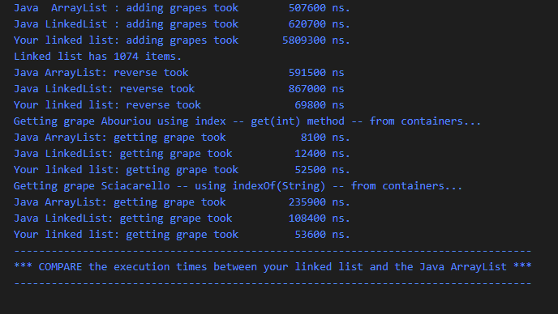
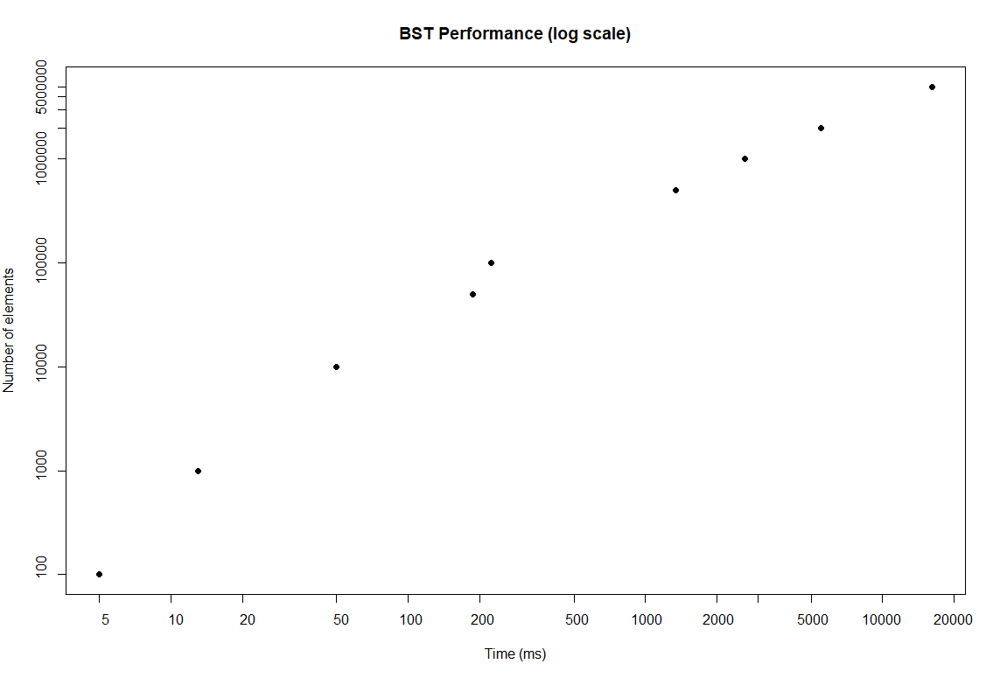
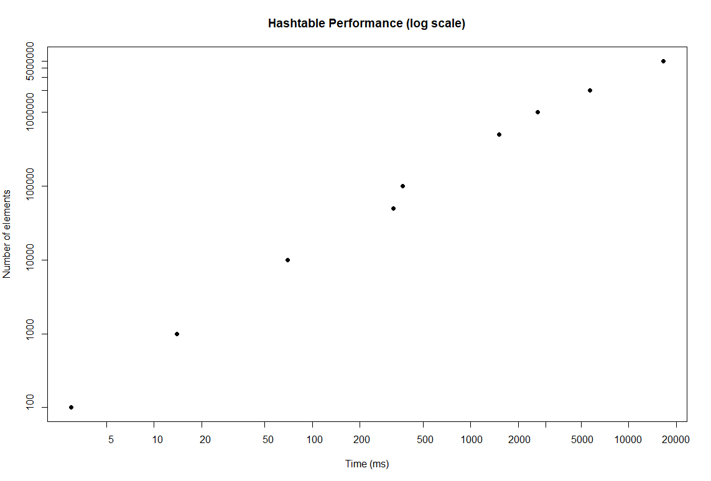

## 00-init

## 01-arrays

## 02-mode

Kuvaajaa lukemalla findMode:n aikakompleksisuusluokka vaikuttaisi olevan $O(n^{2})$, kun se käsittelee Stringejä ja $O(n log(n))$, kun se käsittelee Doubleja.
Koodia lukemalla selviää nopeasti, että algoritmin aikakompleksisuus on $n^{2}$. Koodi sisältää for-loopin sisäisen for-loopin, joissa molemmissa käydään taulukko läpi.
Aikakompleksisuus on harmoniassa graafisen esityksen kanssa (Worst case time complexity = $O(n^{2})$).

## 03-draw

## 04-1-stack

## 04-2-queue

## 04-3-linkedlist

Linkitettyjen listojen vertailutulokset eräältä testikierrokselta (testit näyttivät antavan samantyyliset tulokset joka kerta):

Javan ArrayListiin verrattuna oma linkitetyn listan toteutukseni suoriutui reverse()- ja indexOf(String)-operaatioista huomattavasti nopeammin. Oma toteutukseni suorittaa objektien lisäämisen listaan reilusti hitaammin, kuin Javan toteutukset. Joten Javan toteutukset vaikuttavat olevan yleisessä käytössä nopeampia olettaen, että reverse()-operaatiota ei tarvi yhtä useasti kuin add()-operaatiota.

## 05-binsearch

## 05-invoices

## 67-phonebook

Ylläolevissa kaavioissa molemmat (X ja Y) akselit on skaalattu logaritmisiksi

Lopullinen käyttämäni hajautusfunktio tiivisteiden laskentaan:

    public int hashCode() {
            int hash = 33;
            for(int i = 0; i < firstName.length() - 1; i++) {
                hash = hash * 33 + firstName.charAt(i);
            }
            for(int i = 0; i < lastName.length() - 1; i++) {
                hash = hash * 33 + lastName.charAt(i);
            }
            hash = hash + firstName.length() + lastName.length();
            return hash;
        }

Kokeilin myös hieman erilaisia versioita hajautusfunktiosta, missä käytetty alkuluku (ylläolevassa 33) oli eri. Testitulosten perusteella alkulukua 33 käyttäessä syntyi vähiten törmäyksiä.
Kasvatin hajautustaulun kokoa aina kaksin kertaiseksi, kun reallokointi oli tarpeen. Testidatan kanssa hajautustaulun täyttöaste oli isommilla datamäärillä 76,29% tai 95,37%, joten koin taulukon kaksinkertaistamisen reallokoidessa olevan ainakin
tarpeeksi optimaalinen kokeilematta eri ratkaisuja. 

Hakupuun maksimisyvyys (megalopolis.txt tiedostolle) oli palauttamassani toteutuksessa 18. Muilla kokeilemillani hajautusfunktion variaateilla maksimisyvyys vaihteli 18 - 26 välillä.

Hakupuun ja hajautustaulun lopullisissa toteutuksissa molemmissa hoidetaan törmäykset linkitettyjä listoja hyödyntäen. Toteutin ensin hajautustaulun käyttäen open addressing & probing -metodia. Se toteutus ei kuitenkaan läpäissyt testejä, sillä se suoritui tietyistä testeistä vain ~45 kertaa nopeammin, kuin hidas KeyValueArray-toteutus (testin vaatimuksena oli suoriutua 100 kertaa nopeammin). Tämä johtui massiivisesta törmäysten määrästä (yli 3mrd megalopolis.txt tiedostolle). Törmäysten määrää olisi mahdollisesti saanut pienemmäksi hienosäätämällä hajautusfunktiota ja hajautusfunktiota hyödyntävää indeksin laskentafunktiota, mutta näin helpommaksi tavaksi vain päivittää törmäysten hallintamekanismiksi linkitetyt listat.   

Hakupuun getStatus() metodi tulostaa hakupuun syvyyden, tapahtuneiden törmäysten määrän, sekä pisimmän linkitetyn listan pituuden, joka on muodostunut törmäyksistä. Palauttamassani toteutuksessa oli pienin määrä törmäyksiä sekä hakupuun syvyys oli matalin
verrattuna muihin kokeiluihini.

Hajautustaulun getStatus() metodi tulostaa reallokointien määrän, tapahtuneiden törmäysten määrän, pisimmän syntyneen linkitetyn listan pituuden, sekä hajautustaulun täyttöasteen. Palauttamassani toteutuksessa oli muihin kokeiluihin verrattuna pienin tapahtuneiden törmäysten määrä. Pidin taulun koon kasvatuksen reallokoinnissa aina vakiona, joten reallokointien määrä ja täyttöaste olivat kaikissa toteutuksissa samat.

Toteutin 05-invoices harjoituksessa Quicksort -algoritmin. En kokeillut muita lajittelualgoritmejä, myöskään Heapsort:ia. https://www.geeksforgeeks.org/heap-sort/ sivustolta siteerattua: 

"[Heapsort is]Typically 2-3 times slower than well-implemented QuickSort. The reason for slowness is a lack of locality of reference." 
"The heap sort algorithm has limited uses because Quicksort and Mergesort are better in practice."

Kasvatin kekomuistin kokoa yrittäessäni selvittää alkuvaiheissa miksi hajautustaulu toteutukseni epäonnitui jatkuvasti PerformanceTests:in megalopolis.txt osuudessa. Kävi ilmi, että silloinen ongelma ei ollutkaan kekomuistista johtuva. En enää tämän jälkeen kuitenkaan tehnyt testejä pienemmällä kekomuistin allokoinnilla, kun olin muuttanut sen vakioksi VS Code:ssa. Joten en osaa sanoa varmuudella vaatiiko algoritmien ja tietorakenteiden toiminta kekomuistin kasvattamista.  
